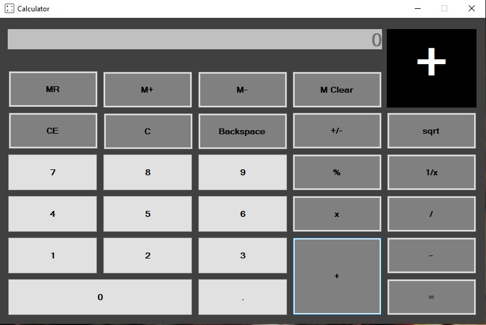
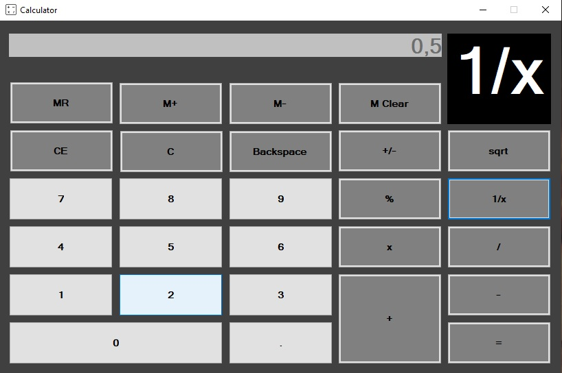

# Calculator

- This project is an implemenation of the classic app Calculator in C#.
- It was created by me using Windows Forms Application in Visual Studio.
- In this app I implemented most of the functionalities of a calculator.

The pictures below show the GUI of my app, which has on top a TextBox to display the numbers, another TextBox on right to display the pressed operator and the buttons to perform actions like mathematical operations and typing numbers. 

